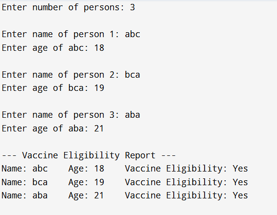

EXP NO:1 C PROGRAM FOR ARRAY OF STRUCTURE TO CHECK ELIGIBILITY FOR THE VACCINE.

Aim:
To write a C program for array of structure to check eligibility for the vaccine person age above 6 years of age.

Algorithm:
1.	Declare structure eligible with age (integer) and n (character array)
2.	Declare variable e of type eligible
3.	Input age and name using scanf, store in e
4.	If e.age <= 6
-	Print "Vaccine Eligibility: No"
Else
-	Print "Vaccine Eligibility: Yes"
5.	Print details (e.age, e.n)
6.	Return 0
 
Program:
```c
#include <stdio.h>
struct eligible {
    int age;
    char name[50];
};
int main() {
    int n, i;  
    printf("Enter number of persons: ");
    scanf("%d", &n);
    struct eligible e[n];  
    for (i = 0; i < n; i++) {
        printf("\nEnter name of person %d: ", i + 1);
        scanf("%s", e[i].name);
        printf("Enter age of %s: ", e[i].name);
        scanf("%d", &e[i].age);
    }
    printf("\n--- Vaccine Eligibility Report ---\n");
    for (i = 0; i < n; i++) {
        printf("Name: %s\t Age: %d\t", e[i].name, e[i].age);
        if (e[i].age <= 6)
            printf("Vaccine Eligibility: No\n");
        else
            printf("Vaccine Eligibility: Yes\n");
    }
    return 0;
}
```


Output:


Result:
Thus, the program is verified successfully.
