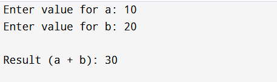

EXP NO:2 C PROGRAM FOR PASSING STRUCTURES AS FUNCTION ARGUMENTS AND RETURNING A STRUCTURE FROM A FUNCTION
Aim:
To write a C program for passing structure as function and returning a structure from a function

Algorithm:
1.	Define structure numbers with members a and b.
2.	Declare variable n of type numbers.
3.	Prompt the user to enter values for a and b.
4.	Input values for a and b into n using scanf.
5.	Call the add function with n as an argument.
6.	Print the result returned by the add function.
7.	Return 0
 
Program:


```c
#include <stdio.h>
struct numbers 
{
    int a, b;
};
struct numbers add(struct numbers n) 
{
    struct numbers result;
    result.a = n.a + n.b;   
    result.b = 0;          
    return result;
}
int main() 
{
    struct numbers n, res;
    printf("Enter value for a: ");
    scanf("%d", &n.a);
    printf("Enter value for b: ");
    scanf("%d", &n.b);
    res = add(n);
    printf("\nResult (a + b): %d\n", res.a);
    return 0;
}
```

Output:




Result:
Thus, the program is verified successfully
