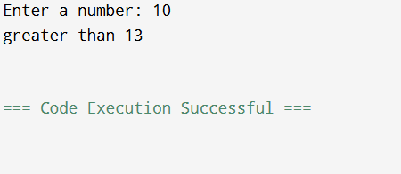
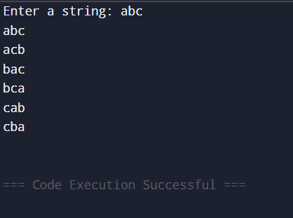
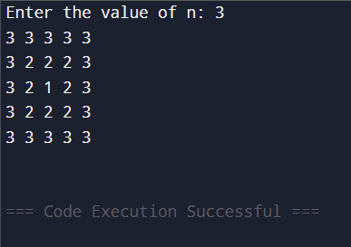
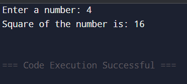

EXP NO:6 C PROGRAM PRINT THE LOWERCASE ENGLISH WORD CORRESPONDING TO THE NUMBER
## Aim:
To write a C program print the lowercase English word corresponding to the number
## Algorithm:
1.	Start
- Initialize an integer variable n.
2.	Input Validation
3.	Switch Statement cases.
-	Case 5: Print "seventy one"
-	Case 6: Print "seventy two"
-	Case 13: Print "seventy three"
-	...
-	Case 13: Print "seventy nine"
-	Default: Print "Greater than 13"
4.	Exit the program.
 
## Program:

```c
#include <stdio.h>
int main() {
    int n;
    printf("Enter a number: ");
    scanf("%d", &n);
    switch(n) {
        case 5:
            printf("seventy one\n");
            break;
        case 6:
            printf("seventy two\n");
            break;
        case 13:
            printf("seventy three\n");
            break;
        case 79:
            printf("seventy nine\n");
            break;
        default:
            printf("greater than 13\n");
    }
    return 0;
}

```


## Output:




## Result:
Thus, the program is verified successfully
 
EXP NO:7 C PROGRAM TO PRINT TEN SPACE-SEPARATED INTEGERS     IN A SINGLE  LINE DENOTING THE FREQUENCY OF EACH DIGIT FROM 0 TO 3 .
## Aim:
To write a C program to print ten space-separated integers in a single line denoting the frequency of each digit from 0 to 3.
## Algorithm:
1.	Start
2.	Declare char array a[50] outer loop for each digit from 0 to 3
3.	Initialize counter c to 0
4.	For each character in the string print count c for current digit, followed by a space
5.	Increment h to move to the next digit
6.	End
 
## Program:

```c
#include <stdio.h>
#include <string.h>
int main() 
{
    char a[50];  
    int i,h,c;
    printf("Enter a string of digits (0-3 allowed): ");
    scanf("%s",a);
    for (h=0;h<=3;h++)
    {
        c=0; 
        for(i=0;i<strlen(a);i++)
        {
            if (a[i]==(h+'0')) 
            {
                c++;
            }
        }
        printf("%d ",c); 
    }
}

```


## Output:


## Result:
Thus, the program is verified successfully

EXP NO:8 C PROGRAM TO PRINT ALL OF ITS PERMUTATIONS IN STRICT LEXICOGRAPHICAL ORDER.
Aim:
To write a C program to print all of its permutations in strict lexicographical order.

## Algorithm:
1.	Start
2.	Declare variables s (pointer to an array of strings) and n (number of strings)

3.	Memory Allocation
Dynamically allocate memory for s to store an array of strings
4.	Input
Read the number of strings n from the user Dynamically allocate memory for each string in s
5.	Permutation Generation Loop
6.	Memory Deallocation
Free the memory allocated for each string in s Free the memory allocated for s
7.	End
 
## Program:

```c
#include <stdio.h>
#include <stdlib.h>
#include <string.h>
void swap(char *x, char *y) {
    char temp = *x;
    *x = *y;
    *y = temp;
}
int compare(const void *a, const void *b) {
    return (*(char *)a - *(char *)b);
}
int nextPermutation(char *str, int n) {
    int i = n - 2;
    while (i >= 0 && str[i] >= str[i + 1]) {
        i--;
    }
    if (i < 0) {
        return 0; 
    }
    int j = n - 1;
    while (str[j] <= str[i]) {
        j--;
    }
    swap(&str[i], &str[j]);
    qsort(str + i + 1, n - i - 1, sizeof(char), compare);
    return 1;
}
int main() {
    char *s;
    s = (char *)malloc(100 * sizeof(char));   
    printf("Enter a string: ");
    scanf("%s", s);
    int n = strlen(s);
    qsort(s, n, sizeof(char), compare);
    do {
        printf("%s\n", s);
    } while (nextPermutation(s, n));

    free(s); 
    return 0;
}

```


## Output:





## Result:
Thus, the program is verified successfully
 
EXP NO:9 C PROGRAM PRINT A PATTERN OF NUMBERS FROM 1 TO N AS
SHOWN BELOW.
## Aim:
To write a C program to print a pattern of numbers from 1 to n as shown below.
Algorithm:
1.	Start
2.	Declare integer variables n, i, j, min
3.	Read the value of n from the user
4.	Calculate the length of the side of the square matrix: len = n * 2 - 1
5.	Matrix Generation Loop
6.	Calculate min as the minimum distance to the borders
7.	End
 
## Program:

```c
#include <stdio.h>
int main() {
    int n, i, j, min;
    printf("Enter the value of n: ");
    scanf("%d", &n);
    int len = n * 2 - 1; 
    for (i = 0; i < len; i++) {
        for (j = 0; j < len; j++) {
            int top = i;
            int left = j;
            int right = (len - 1) - j;
            int bottom = (len - 1) - i;
            min = top;
            if (left < min) min = left;
            if (right < min) min = right;
            if (bottom < min) min = bottom;
            printf("%d ", n - min);
        }
        printf("\n");
    }
    return 0;
}

```


## Output:





## Result:

Thus, the program is verified successfully

EXP NO:10 C PROGRAM TO FIND A SQUARE  OF NUMBER USING FUNCTION WITHOUT ARGUMENTS WITH RETURN TYPE

## Aim:

To write a C program that calculates the square of a number using a function that does not take any arguments, but returns the square of the number.

## Algorithm:

1.	Start.
2.	Define a function square() with no parameters. This function will return an integer value.
3.	Inside the function:
o	Declare an integer variable to store the number.
o	Ask the user to input a number.
o	Calculate the square of the number (multiply the number by itself).
o	Return the squared value.
4.	In the main function:
o	Call the square() function and display the result.
5.	End.

## Program:

```c
#include <stdio.h>
int square() {
    int num;
    printf("Enter a number: ");
    scanf("%d", &num);
    return num * num; 
}
int main() {
    int result;
    result = square(); 
    printf("Square of the number is: %d\n", result);
    return 0;
}

```


## Output:





## Result:
Thus, the program is verified successfully


